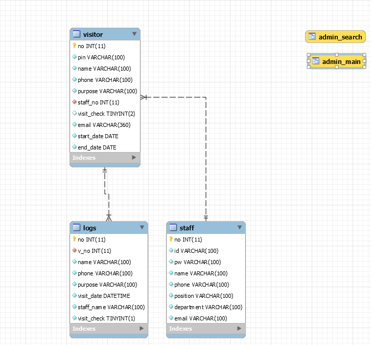
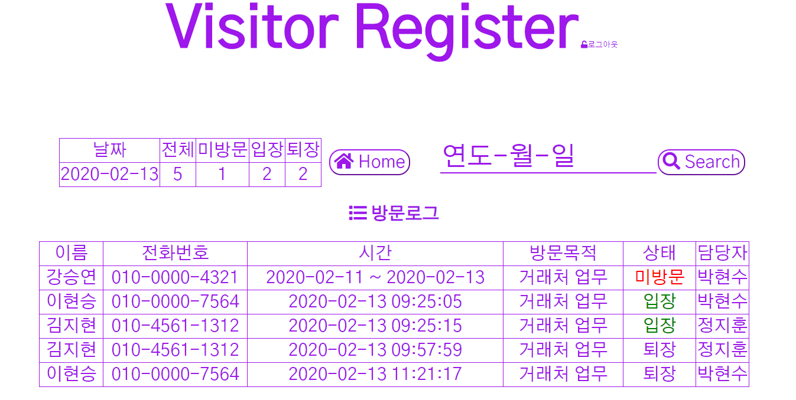

# Visitor_Register
* * *
## 방문자 관리 웹페이지
* * *
### 1. 기능 
 + 회사의 직원이 회원가입한다
 + 직원이 방문객의 인적사항과 방문날짜를 입력하고 추가한다.
 + 추가 후 방문객의 고유 핀번호 (방문시작날짜+랜덤번호 4자리 YYYYMM - DDXXXX) 가 저장된 QR코드를 방문객 이메일로 전송한다.
 + 방문객은 회사 문에 달려있는 태블릿 어플을 이용하여 자신임을 증명한다.
 + 증명방법은 QR코드 리더와 고유 핀번호 입력 총 두가지이다.
 + 등록된 방문객이라면 문이 열리고 등록되지않은 방문객이라면 문이 열리지않는다.
 + 방문객은 입장시와 퇴장시에 두번 입력한다. 
 + 방문객이 들어오거나 나가게 되면 해당 방문객을 등록한 직원의 이메일로 방문객이 들어오거나 나갔다고 이메일을 전송한다.
 + 직원은 방문객의 내용을 수정하거나 삭제할 수 있다. 단 수정이나 삭제는 오늘 날짜 이후만 가능하다.
 + 관리자로 로그인하면 현재 방문현황과 지난 날의 방문 로그를 확인할 수 있다.
 * * *
### 2. 개발환경
 + Nodejs v12.14.0
 + Npm 6.13.4
 + Mysql 8.0.18 
 + Android studio 3.5.3
* * *
### 3. DB
 
 * * *
### 4. 태블릿 어플
 + <https://github.com/wnsgh1030/visitor_register_android>
 * * *
### 5. 배포
 + Heroku로 배포
 + <https://visitor-register.herokuapp.com/>
* * *
### 6. 라이브러리
 + passport (로그인 회원가입)
 + nodemailer (메일)
 + qrcode (QR코드)
 + moment (시간)
 + sweetalert (알림창)
 * * *
### 7. 예시
 
